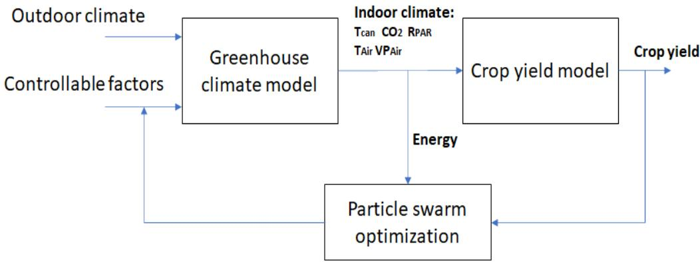
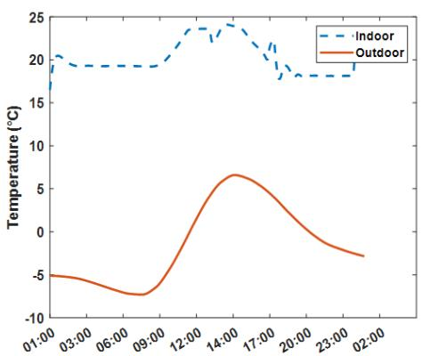
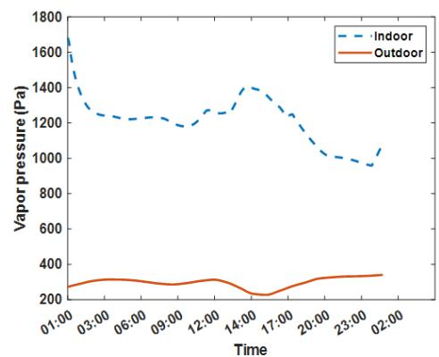
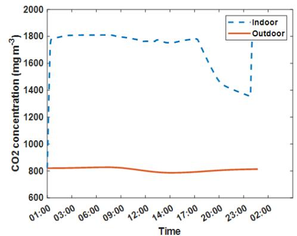
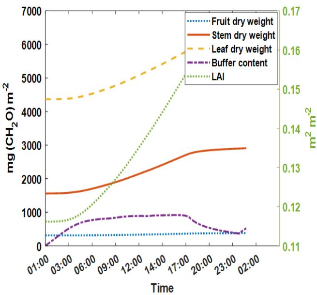
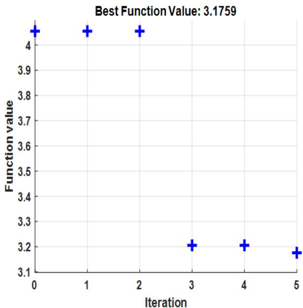

Article

# Optimizing Crop Yield and Reducing Energy Consumption in Greenhouse Control Using PSO-MPC Algorithm

Liyun Gong, Miao Yu * and Stefanos Kollias

School of Computer Science, University of Lincoln, Lincoln LN6 7TS, UK

* Correspondence: myu@lincoln.ac.uk

Abstract: In this study, we present a novel smart greenhouse control algorithm that optimizes crop yield while minimizing energy consumption costs. To achieve this, we relied on both a greenhouse climate model and a greenhouse crop yield model. Our approach involves applying the model predictive control (MPC) method, which utilizes the particle swarm optimization (PSO) algorithm to identify optimal controllable parameters such as heating, lighting, ventilation levels. The objective of the optimization is to maximize crop yield while minimizing energy consumption costs. We demonstrate the superiority of our proposed control algorithm in terms of performance and energy efficiency compared to the traditional control algorithm. The effectiveness of the PSO-based optimization strategy for finding optimal controllable parameters for MPC control is also demonstrated, outperforming the traditional genetic algorithm optimization. This study provides a promising approach to smart greenhouse control with the potential for increasing crop yield while minimizing energy costs.

Keywords: greenhouse control; model predictive control; particle swarm optimization; greenhouse climate model; biophysical model

Citation: Gong, L.; Yu, M.; Kollias, S. Optimizing Crop Yield and Reducing Energy Consumption in Greenhouse Control Using PSO-MPC Algorithm. Algorithms 2023, 16, 243. https://doi.org/10.3390/a16050243

Academic Editor: Jing Wang

Received: 22 March 2023

Revised: 26 April 2023

Accepted: 5 May 2023

Published: 7 May 2023

Copyright: © 2023 by the authors. Licensee MDPI, Basel, Switzerland. This article is an open access article distributed under the terms and conditions of the Creative Commons Attribution (CC BY) license (https://creativecommons.org/licenses/by/4.0/).

# 1. Introduction

Greenhouse cultivation has gained widespread popularity among crop growers due to its numerous benefits, including the extended growing season and protection of crops against temperature and weather changes, creating a safe environment for plant growth. In modern greenhouses, climatic conditions such as humidity, temperature, radiation, and carbon dioxide can be adjusted using a control system that regulates factors such as temperature, humidity, lighting, and air circulation to create optimal growing conditions for plants [1]. A variety of greenhouse control systems are available ranging from basic manual methods to advanced automated systems that utilize sensors, computers, and other electronic components to monitor and adjust growing conditions in real time [1]. Effective greenhouse control is critical for growers who require consistent, optimal growing conditions to produce high-quality crops. With the right greenhouse control methods and technologies, growers can improve crop yields, reduce waste, and minimize the impact of external factors such as weather changes on their operations.

Greenhouse control algorithms are software programs integrated into greenhouse control systems that were designed to automate and optimize the management of environmental conditions within a greenhouse or other controlled growing environment. These algorithms utilize input from sensors that measure temperature, humidity, and light levels, and other factors, and perform real-time adjustments to environmental controls, such as heating, cooling, ventilation, and irrigation, to create optimal growing conditions for plants [2]. The development of greenhouse control algorithms has been greatly aided by advances in computer technology and the increasing availability of low-cost sensors and microcontrollers. These advancements have enabled growers to implement sophisticated control systems that respond quickly to changes in growing conditions and can be customized to meet the unique requirements of various plant species.

Greenhouse control algorithms come in a variety of forms, ranging from simple, rule-based systems to more sophisticated machine learning and artificial intelligence (AI) algorithms. Some commonly used types include proportional-integral-derivative (PID) control algorithms [3], fuzzy logic control [4-7], artificial neural networks (ANNs) [8-10], and model predictive control (MPC) algorithms [11-13]. These algorithms serve as an essential tool for growers seeking to optimize their crop yields and increase the efficiency of their operations. By leveraging the power of modern computing technology, growers can attain precise and effective control over the environmental conditions in their greenhouses, which leads to the production of higher-quality crops and more sustainable agricultural practices.

The structure of this paper is shown below: A literature review of relevant works related to greenhouse control is given in Section 2. The proposed methodology, including the greenhouse climate model, biophysical model, and PSO-MPC control algorithm, is given in Section 3. Experimental results are provided in Section 4 to show the effectiveness of the proposed algorithm. Lastly, conclusions and future works are given in Section 5.

# 2. Literature Reviews

Several research studies have been conducted to develop algorithms for controlling greenhouses, as proposed in Oliveira et al. [14]. One study proposed a simple self-tuning PID control method (STPID) to regulate temperature, humidity, and  $\mathrm{CO}_{2}$  concentration, using the Levenberg-Marquart algorithm to adjust the PID parameters as proposed by Su et al. in [3]. Another study employed a fuzzy logic control algorithm proposed by Alpay et al. in [4], where data from sensors were used as state variables, and factors such as heating, cooling, irrigation, lighting, and shading were generated as control variables to regulate the greenhouse environment. Rule tables created by experts were used to establish the relationship between state and control variables to produce control outputs on the basis of sensor data. In yet another study, an extended Kalman filter was applied together with a logic control algorithm to estimate the air temperature and humidity ratio instead of relying on the noisy sensor measurements proposed by Hameed [5]. This improved the efficiency of the greenhouse climate controller by reducing false alarms and fault detections. To enhance the performance of the logic-based control algorithm, Mohamed et al. [6] adopted a genetic algorithm (GA) to adapt the controller parameters. Their proposed neurofuzzy controller used both temperature (T) and humidity (H) to provide smooth control, regardless of changing environmental conditions or plant complexity. However, these techniques required additional sensors to be installed inside the greenhouse for controlling purposes. Su et al. [7] developed a compound control scheme aimed at maximizing crop yield while minimizing energy consumption. The control laws of heating, fogging, and  $\mathrm{CO}_{2}$  injection were derived using feedback linearization techniques. A model-based fuzzy adaptive control approach was then applied to compensate for actuator saturation, and an energy-saving management mechanism was designed to minimize energy usage. Simulation results confirmed the effectiveness of this approach in energy conservation.

Data-driven control algorithms have been applied to greenhouse scenarios as well. In a study by Salah et al. [8], a deep multilayer perceptron (MLP) neural network was used as a controller to regulate the internal climate of the greenhouse. Simulation results indicated that the best performance was achieved with a neural controller consisting of two hidden layers, and an Elman neural model with two hidden and context layers. Similarly, an optimal neural-network-based nonlinear autoregressive model was proposed in Manonmani et al. [9] to achieve desired growth conditions, such as temperature and humidity, for improved yield. In another study proposed by Zhang in [10], a fuzzy neural network was applied to regulate the internal climate of the greenhouse, and simulation results showed that this controller had certain improvements over conventional PID controllers in terms of overshoot, stability, and response time. Additionally, other machine-learning-based control strategies have been recently adopted for greenhouse control, including a deep reinforcement learning approach proposed by Wang et al. in [15] for cucumber climate control, which controlled three controllable factors with a reward function aimed

at improving cumulative fruit weight and reducing costs. However, data-driven control algorithms such as neural networks require large amounts of data to train models for effective greenhouse control. In another study proposed by Atia et al. in [16], different control strategies, including PI control, fuzzy logic control, artificial neural network control, and adaptive neuro-fuzzy control, were compared to adjust greenhouse indoor temperature to the required value.

In addition to traditional control approaches, such as PID and fuzzy logic, model predictive control (MPC) has recently been applied to greenhouse control, particularly for energy saving, as discussed in Bersani et al. [11]. MPC can find an optimal solution to achieve various objectives (e.g., maximizing crop yield, maintaining stable greenhouse climate, and minimizing energy costs) by modeling the system dynamics with reasonable accuracy. For example, in Zou et al. [12], a nonlinear MPC algorithm based on particle swarm optimization (PSO) was proposed to minimize energy consumption while regulating climatic temperature variables. A similar approach was presented by Lin et al. in [13], where MPC was used to minimize the total energy costs for greenhouse heating and cooling while controlling greenhouse climatic conditions. Comparison results demonstrated that MPC outperformed open-loop control algorithms. Furthermore, as proposed by Hu et al. in [17], a more complex multi-objective compatible control (MOCC) strategy was proposed with an extended greenhouse model to achieve climate control through feedback control architecture. Multi-objective evolutionary algorithms (MOEAs) are applied to optimize an objective function that controls greenhouse climate parameters. Simulation experiments were conducted to validate the feasibility of the proposed algorithm through various comparative studies. An MPC algorithm for greenhouse air temperature predictive control using the particle swarm optimization algorithm was proposed by Coelho et al. in [18].

In this work, we propose an MPC algorithm to control factors related to heating, lighting, and ventilation in order to adapt greenhouse climatic conditions for optimizing crop yield while minimizing energy costs. Our MPC algorithm consists of a greenhouse climate model proposed by Vanthoor et al. in [19] that estimates greenhouse climatic factors (e.g.,  $\mathrm{CO}_{2}$ , temperature, humidity) on the basis of outdoor environmental information, and a crop yield model proposed by Vanthoor et al. in [20] that estimates crop growth on the basis of greenhouse climatic factors. Using these two models, we adopted the particle swarm optimization (PSO) algorithm proposed by Kennedy et al. in [21] to tune controllable parameters and minimize an objective function that targets maximizing crop yield and minimizing energy costs. Our proposed approach does not require any sensor equipment, like [4,5], nor high amounts of training data, like data-driven approaches [8-10,15], rendering it easy to implement. Furthermore, our approach fully takes into account different types of lighting conditions (LED and HPS) that affect crop growth and targets while aiming to balance both energy and yield for achieving the best profits. The simulation results show that our proposed approach achieves better performance than that of other control strategies for different periods of time. Additionally, the PSO optimization algorithm performs better in optimizing the objective function in our proposed MPC strategy than the traditional genetic algorithm (GA) does.

# 3. Methodology

An overview of the method is presented in Figure 1, which illustrates the three key components of the approach: the greenhouse climatic model, the biophysical model, and the particle swarm optimization algorithm. The greenhouse climatic model is the first component of the proposed approach. It is a model that simulates the climate conditions inside the greenhouse. This model takes into account various factors that affect the greenhouse environment, such as temperature, humidity, lighting, and air circulation. The greenhouse climate model provides a detailed understanding of climatic conditions inside the greenhouse, which is essential for optimizing the growing conditions for crops. The second component of the proposed approach is the biophysical model. This model simulates the growth of plants in the greenhouse. It takes into account various factors that affect

plant growth, such as light intensity, temperature, humidity, and nutrient availability. The biophysical model provides a detailed understanding of how the plants are growing in the current conditions of the greenhouse. The third component of the proposed approach is the particle swarm optimization algorithm, which is used to optimize the control parameters in the greenhouse on the basis of both the greenhouse climatic model and the biophysical model. The algorithm uses a population of particles that move through the search space to find the optimal controllable parameters solution, to reduce the consumed energy while maximizing the crop yield.

Figure 1. Overview of the proposed methodology for greenhouse control.

# 3.1. Greenhouse Climatic Model

The greenhouse climatic model that we adopted in this work is presented in [19], which was constructed on the basis of the assumptions presented in [19]. These assumptions include: (1) the absence of spatial differences in temperature, vapour pressure, and  $\mathrm{CO}_{2}$  concentration, and (2) dividing the greenhouse air into two compartments (below and above the thermal screen) to describe the effect of the thermal screen on the indoor climate. The model includes the following elements: the design elements depicted in Figure 2, a lumped cover description that combines the impact of different cover layers on the indoor climate, state variables for internal and external cover temperatures to describe the impact of cover insulation on indoor climate, a description of the far infrared radiation (FIR) transmission through the cover, which is necessary for films that partially transmit FIR, a description of both roof and side ventilation, a description of the impact of insect screens on ventilation rate, and a description of the near infrared radiation (NIR) absorption of both canopy and floor, which depends on the optical properties of the cover and floor.

In this work, the state variables of the indoor greenhouse climate, such as temperature,  $\mathrm{CO}_{2}$  concentration, and vapor, are represented in the model. These state variables are critical for understanding and controlling the growing environment within the greenhouse. The dynamics of these state variables over time are expressed as differential equations (1) that take into account the relationships between different factors. These differential equations represent the rate of change of each state variable as a function of time, as shown in Figure 2. For example, the dynamics of temperature in the model are defined by a differential equation that takes into account factors such as the rate of heat exchange between the greenhouse and the outside environment, the rate of heat exchange between the greenhouse and the plants, and the rate of heat generation within the greenhouse due to lighting and other sources.

Figure 2. Comparisons of outdoor and simulated indoor climatic factors.

$$
\begin{array}{l} c a p _ {A i r} \dot {T} _ {A i r} = H _ {C a n A i r} + H _ {M e c h A i r} + H _ {P i p e A i r} + H _ {P a s A i r} + H _ {B l o w A i r} + R _ {G l o b _ {S} U n A i r} \\ - H _ {A i r F l r} - H _ {A i r O u t} - H _ {A i r T o p} - H _ {A i r O u t _ {P a d}} - L _ {A i r F o g} \\ \end{array}
$$

$$
\begin{array}{l} c a p _ {V P _ {\text {a i r}}} \dot {V} P _ {\text {A i r}} = M V _ {\text {C a n A i r}} + M V _ {\text {P a d A i r}} + M V _ {\text {F o g A i r}} + M V _ {\text {B l o w A i r}} - M V _ {\text {A i r T h S r c}} - M V _ {\text {A i r T o p}} \tag {1} \\ - M V _ {A i r O u t} - M V _ {A i r O u t p a d} - M V _ {A i r M e c h} \\ \end{array}
$$

$$
c a p _ {C O _ {2} a i r} C \dot {O} _ {2 A i r} = M C _ {B l o w A i r} + M C _ {E x t A i r} + M C _ {P a d A i r} - M C _ {A i r C a n} - M C _ {A i r T o p} - M C _ {A i r O u t}
$$

where  $T_{Air}$ ,  $VP_{Air}$  and  $CO_{2Air}$  represent the greenhouse indoor air temperature, vapor pressure, and  $CO_2$  concentration.  $H$  represents the sensible heat flux density,  $MC$  represents the mass  $CO_2$ -flux density, and  $MV$  represents the mass vapour flux density; the definitions of every term are given in [19].

By solving the differential equations that govern the dynamics of the greenhouse environment taking into account both outdoor meteorological conditions and controllable factors, it is possible to estimate the state variables of the greenhouse environment, such as temperature,  $\mathrm{CO}_{2}$  concentration, and vapor pressure, which are important parameters for the crop growth. Moreover, these estimates can then be used to inform control strategies, allowing for the grower to maintain optimal growing conditions for the plants and maximize crop yield.

# 3.2. Biophysical Model

The biophysical model structure that we used was based on the one proposed in [20]. The growth of crops through photosynthesis in a greenhouse is mainly dependent on canopy temperature, PAR, and  $\mathrm{CO}_{2}$  concentration. The five-step process for determining the canopy photosynthesis rate is calculating the maximal rate of electron transport at  $25^{\circ}C$  at the canopy level, determining the potential rate of electron transport, calculating the electron transport rate, determining the gross photosynthesis rate at the canopy level, and lastly calculating the net photosynthesis rate. The photosynthesized carbohydrates are stored in a buffer,  $C_{Buf}$ , whose outflow is affected by temperature. The buffer distributes the

carbohydrates ( $MC_{BufFruit}$ ,  $MC_{BufLeaf}$ ,  $MC_{BufStem}$ ) to the plant organs ( $C_{Fruit}$ ,  $C_{Leaf}$ ,  $C_{Stem}$ ). The model calculates fruit weight and numbers for each development stage and the portion of organ carbohydrates used for maintenance respiration. The harvested crop's dry matter is determined by integrating carbohydrate outflow from the last fruit's development stage.

The state variables of the model, such as carbohydrate amount and dry matter, are described with differential equations that reflect the dynamics of these variables over time. These differential equations take into account the canopy photosynthesis and carbohydrate flow within the plant. By solving these differential equations, it is possible to predict the behavior of the plant over time, including its growth and development, and its response to different environmental conditions and management strategies. The specific dynamics of key state variables in this model are shown below:

$$
\dot {C} _ {B u f} = M C _ {A i r B u f} - M C _ {B u f F r u i t} - M C _ {B u f L e a f} - M C _ {B u f S t e m} - M C _ {B u f A i r}
$$

$$
\begin{array}{l} \dot {C} _ {F r u i t \{j \}} = M C _ {B u f F r u i t \{j \}} + M C _ {F r u i t \{j - 1 \} F r u i t \{j \}} - M C _ {F r u i t \{j \} F r u i t \{j + 1 \}} - M C _ {F r u i t A i r \{j \}} \\ \dot {C} _ {\text {L e a f}} = M C _ {\text {B u f L e a f}} - M C _ {\text {L e a f A i r}} - M C _ {\text {L e a f H a r}} - M C _ {\text {F r u i t A i r} \{j \}} \tag {2} \\ \dot {C} _ {\text {S t e m}} = M C _ {\text {B u f S t e m}} - M C _ {\text {S t e m A i r}} \\ \end{array}
$$

$$
D M _ {H a r} = \eta \cdot M C _ {F r u i t H a r}
$$

where  $C_{Buf}$ ,  $C_{Leaf}$ , and  $C_{Stem}$  represent the carbohydrates in buffer, leaves, and stems, respectively, while  $C_{Fruit\{j\}}$  represents the carbohydrate at the j-th stage flower development stage.  $DM_{Har}$  represents the harvested dry matter. The detailed explanations of each term in (2) are presented in [20]. Carbohydrates for different organs and dry matter representing the crop yield can be estimated by solving these differential equations, which can then be used to estimate the crop yield.

From the aforementioned greenhouse climate and biophysical models, the crop growth can be estimated based on outdoor meteorological and control parameters, which can be tuned optimally by our developed PSO-MPC control algorithm (details are in the next subsection) targeting for maximizing crop growth with a minimum energy cost.

# 3.3. PSO-MPC Control Algorithm

In this work, a model predictive control (MPC) algorithm was adopted for greenhouse control to balance the crop yield. The objective of the MPC algorithm is to optimize the controllable parameters such as heating, ventilation, and lighting levels while ensuring that the crop yield is maximized and energy costs are minimized. To achieve this, an objective function is defined below that takes into account both the crop yield and energy costs:

$$
\begin{array}{l} \max  _ {\mathbf {u}} \sum_ {i = j} ^ {j + T} (D M ((i + 1) \Delta t) - D M (i \Delta t)) - \gamma \cdot \Delta E n e r g y _ {i} \tag {3} \\ 0 \leq \mathbf {u} \leq \mathbf {1} \\ \end{array}
$$

where  $\mathbf{u}$  represents the greenhouse control parameters during a horizontal time  $[j\Delta t, (j + 1)\Delta t, \dots, (j + T)\Delta t]$ .  $DM(i\Delta t)$  represents the dry matter at  $i\Delta t$ .  $\Delta Energy_{i}$  represents the energy consumption of the lamp, boiler, and heat harvesting system calculated with the greenhouse climatic model during  $[i\Delta t, (i + 1)\Delta t]$  according to [22]. In specific, it is calculated as:

$$
\Delta E n e r g y _ {i} = \int_ {i \Delta t} ^ {(i + 1) \Delta t} l a m p E n e r g y (t) + b o i l E n e r g y (t) + h h E n e r g y (t) d t \tag {4}
$$

where  $\Delta Energy_{i}$  represents the consumed energy during  $[i\Delta t, (i + 1)\Delta t]$ . lampEnergy(t), boilEnergy(t) and hhEnergy(t) represent the time-dependent lamp energy, boiler energy, and heat harvest system energy, respectively, as calculated in [22]. By solving the above optimization problem, we can maximize the crop growth while restraining the energy cost.

To solve (3), we utilized a PSO algorithm. PSO is a population-based stochastic optimization algorithm inspired by the collective behavior of animals such as flocks of

birds or schools of fish [23]. We first generated  $N$  solution candidates (also referred to as particles)  $[X_1^0, \ldots, X_N^0]$  and their corresponding velocities  $[V_1^0, \ldots, V_N^0]$ . Each particle had an associated fitness value that could be evaluated using the objective function defined in (3). Particle values were updated with the following equations until the optimal solution was found:

$$
\begin{array}{l} V _ {i} ^ {g + 1} = w V _ {i} ^ {g} + C _ {1} * \operatorname {r a n d} () * \left(P B _ {i} - X _ {i} ^ {g}\right) + C _ {2} * \operatorname {r a n d} () * \left(G B ^ {g} - X _ {i} ^ {g}\right) \tag {5} \\ X _ {i} ^ {g + 1} = X _ {i} ^ {g} + V _ {i} ^ {g + 1} \\ \end{array}
$$

where  $V_{i}^{g}$  and  $X_{i}^{g}$  represent the  $i$ -th velocity and and position of particle  $i$ , respectively, in the  $g$ -th generation.  $C_{1}, C_{2}$  represent the learning factors. rand() generates a random number in [0,1].  $PB_{i}$  and  $GB^{g}$  represent the personal best performance for the  $i$ -th particle and the best performance of the group for the  $g$ -th generation, respectively, determined via the objective function.  $w$  is the inertial weight that shows the effect of the previous velocity vector on the new vector. By exploiting the PSO algorithm, the optimal control parameters which minimize the objective function can be effectively found. And the comparisons between the PSO algorithm and other optimization methodologies, such as the genetic algorithm are provided in the experimental section.

# 4. Experimental Studies

Our proposed algorithm was evaluated on the basis of the configuration of a real greenhouse (as described in [19]) and using actual weather conditions around the location of the greenhouse (as described in [24]). The weather conditions included outdoor global irradiation, outdoor air temperature, outdoor vapor concentration, outdoor  $\mathrm{CO}_{2}$  concentration, and outdoor wind speed for 10 days. Using this information along with greenhouse specification details, we applied the greenhouse climatic model as mentioned in Section 2 to simulate the indoor climate. The results of the comparison between indoor and outdoor climatic factors (such as temperature, vapor pressure, relative humidity, and  $\mathrm{CO}_{2}$  concentration) are presented in Figure 2. Additionally, we used the obtained indoor climatic factors to simulate the crop yield using a biophysical model. The simulation included different parameters related to crop growth, such as organ dry weight and leaf area index, which are presented in Figure 3.

Figure 3. Parameters related to crop growth obtained through the crop yield model.

For implementing the PSO algorithm to optimize the MPC objective function as in (3), we used the MATLAB optimizer toolbox [25] with a population size of 10 and 5 generations. Parameter  $\gamma$  in (3) was set to 8. The parameters of the biophysical model and greenhouse climate model were the same as those used in [19,20]. The PSO algorithm was applied to find the optimal greenhouse controllable parameters, including heating from the boiler, heating to grow pipes, lighting from top/interlights, and ventilation from the roof. All values were within the range of [0,1]. An example of the objective function value variations with respect to the iteration number of PSO is shown in Figure 4. As the iteration number increases, the objective function value decreases, indicating that better solutions of controllable parameters are obtained, minimizing the objective function.

Figure 4. Objective function values with respect to PSO iterations.

We tested our PSO-MPC algorithm for greenhouse control over different time intervals of 21, 41, and  $61\mathrm{h}$ . To compare its effectiveness, we implemented the rule-based control algorithm proposed by [22] using the same greenhouse climatic and biophysical models. We calculated the yield, energy cost, and energy efficiency (defined as the ratio of energy cost to yield) for both control algorithms. The comparison results are presented in Tables 1-3. Our analysis reveals that the PSO-MPC algorithm consistently outperformed the rule-based approach in terms of energy efficiency, indicating that less energy was consumed to achieve the same yield. These results demonstrate that the PSO-MPC control approach offers superior energy savings compared to the rule-based method.

In our study, we compared the performance of two different optimization algorithms, PSO and GA, for objective function optimization within an MPC framework. PSO is a heuristic optimization method inspired by the behavior of social swarms, while GA is a genetic algorithm based on natural selection and evolution principles. To ensure a fair comparison, we used the same population size and generation for both algorithms. Additionally, we performed multiple trials and conducted a statistical analysis.

Table 4 presents the mean and standard deviation of crop yield and consumed energy obtained by each algorithm. It is evident that, under the same population size and generation settings, the GA failed to effectively solve the MPC, leading to a decrease in crop yield (indicated by the negative growth). In contrast, the PSO algorithm was successful in finding the optimal solution for the MPC framework, leading to high positive growth. These results demonstrate that the PSO algorithm was more effective than the GA in optimizing the objective function within the MPC framework.

Table 1. Comparisons between the MPC algorithm and traditional proportional control algorithm for  ${21}\mathrm{\;h}$  .

<table><tr><td></td><td>Yield (mg/m2)</td><td>Consumed Energy (MJ/m2)</td><td>Energy Efficiency</td></tr><tr><td>Rule-based algorithm</td><td>57.57</td><td>4.87</td><td>0.085</td></tr><tr><td>Proposed algorithm</td><td>152.17</td><td>7.88</td><td>0.052</td></tr></table>

Table 2. Comparisons between MPC algorithm and traditional proportional control algorithm for  ${41}\mathrm{\;h}$  .

<table><tr><td></td><td>Yield (mg/m2)</td><td>Consumed Energy (MJ/m2)</td><td>Energy Efficiency</td></tr><tr><td>Rule-based algorithm</td><td>219.80</td><td>9.70</td><td>0.044</td></tr><tr><td>Proposed algorithm</td><td>481.12</td><td>14.70</td><td>0.031</td></tr></table>

Table 3. Comparisons between MPC algorithm and traditional proportional control algorithm for  $81\mathrm{h}$

<table><tr><td></td><td>Yield (mg/m2)</td><td>Consumed Energy (MJ/m2)</td><td>Energy Efficiency</td></tr><tr><td>Rule-based algorithm</td><td>842.20</td><td>19.67</td><td>0.023</td></tr><tr><td>Proposed algorithm</td><td>1799.30</td><td>33.29</td><td>0.019</td></tr></table>

Table 4. Comparison of different MPC optimization algorithms through statistical analysis.

<table><tr><td></td><td>Yield (mg/m2)</td><td>Consumed Energy (MJ/m2)</td></tr><tr><td>GA</td><td>-0.0484 ± 2.2942</td><td>3.1618 ± 0.3924</td></tr><tr><td>PSO</td><td>131.9381 ± 22.3560</td><td>6.4741 ± 1.7893</td></tr></table>

# 5. Conclusions and Future Works

The aim of this work was to propose a particle swarm optimization model predictive control (PSO-MPC) algorithm for greenhouse control. This algorithm was designed to optimize the controllable parameters of a greenhouse, such as heating, ventilation, and lighting levels, by using a combination of a greenhouse climatic model and a biophysical model. The goal was to maximize crop yield while minimizing energy costs. To achieve this goal, the PSO-MPC algorithm leverages a model predictive-control-based approach that exploits particle swarm optimization, which is a heuristic optimization method that is inspired by the behavior of social swarms, such as bird flocks or fish schools, to determine the optimal controllable parameters for greenhouse control. It uses a population of particles that move through the search space to find the optimal solution. The PSO-MPC algorithm outperformed traditional control algorithms by leveraging real weather conditions and greenhouse configuration information. The results of the study show that the PSO-based optimization approach performed better than the GA for objective function optimization within the MPC framework.

In future work, the proposed control approach will be evaluated in different scenarios, including different greenhouse locations, crop types, and weather conditions. This would help in validating the effectiveness of the proposed algorithm in real-world applications, and would demonstrate its potential to optimize greenhouse control in various settings. Overall, the proposed PSO-MPC algorithm is a promising approach for greenhouse control that could help in maximizing crop yield while minimizing energy costs. The use of a predictive-control-model-based approach with particle swarm optimization enables the algorithm to optimize the controllable parameters of a greenhouse in real time, ensuring that the growing conditions remain optimal for the plants.

Author Contributions: Writing—original draft preparation, L.G.; methodology development and validation, L.G.; writing—review and editing, M.Y. and S.K. All authors have read and agreed to the published version of the manuscript.

Funding: This research was supported as part of SMARTGREEN, an Interreg project supported by the North Sea Programme of the European Regional Development Fund of the European Union.

Data Availability Statement: Data are available on request.

Acknowledgments: This research was supported as part of SMARTGREEN, an Interreg project supported by the North Sea Programme of the European Regional Development Fund of the European Union.

Conflicts of Interest: The authors declare no conflict of interest.

# References

1. Ponce, P.; Molina, A.; Cepeda, P.; Lugo, E.; MacCleery, B. Greenhouse Design and Control; CRC Press: Boca Raton, FL, USA, 2014.

2. Straten, G.; Willigenburg, G.; Henten, E.; Ooteghem, R. Optimal Control of Greenhouse Cultivation; CRC Press: Boca Raton, FL, USA, 2010.

3. Su, Y.; Yu, Q.; Zeng, L. Model Parameter Self-Tuning PID Control for Greenhouse Climate Control Problem. IEEE Access 2020, 8, 186157-186171. [CrossRef]

4. Alpay, Ö.; Erdem, E. The Control of Greenhouses Based on Fuzzy Logic Using Wireless Sensor Networks. Int. J. Comput. Intell. Syst. 2019, 14, 190-203. [CrossRef]

5. Hameed, I. Using the extended Kalman filter to improve the efficiency of greenhouse climate control. Int. J. Innov. Comput. Inf. Control. IJICIC 2010, 6, 2671-2680.

6. Mohamed, S.; Hameed, I. A GA-Based Adaptive Neuro-Fuzzy Controller for Greenhouse Climate Control System. Alex. Eng. J. 2018, 57, 773-779. [CrossRef]

7. Su, Y.; Xu, L.; Goodman, E. Greenhouse Climate Fuzzy Adaptive Control Considering Energy Saving. Int. J. Control. Autom. Syst. 2017, 15, 1936-1948. [CrossRef]

8. Salah, L.; Fourati, F. A greenhouse modeling and control using deep neural networks. Appl. Artif. Intell. 2021, 35, 1905-1929. [CrossRef]

9. Manonmani, A.; Thyagarajan, T.; Elango, M.; Sutha, S. Model Modelling and control of greenhouse system using neural networks. Trans. Inst. Meas. Control 2018, 40, 918-929. [CrossRef]

10. Zhang, X. Model A Novel Greenhouse Control System Based on Fuzzy Neural Network. Appl. Mech. Mater. 2014, 668, 415-418. [CrossRef]

11. Bersani, C.; Ouammni, A.; Sacile, R.; Zero, E. Model Predictive Control of Smart Greenhouses as the Path towards Near Zero Energy Consumption. Energies 2020, 13, 3647. [CrossRef]

12. Zou, Q.; Ji, J.; Zhang, S.; Shi, M. Model predictive control based on particle swarm optimization of greenhouse climate for saving energy consumption. In Proceedings of the 2010 World Automation Congress, Kobe, Japan, 19-23 September 2010.

13. Lin, D.; Zhang, L.; Xia, X. Greenhouse Climate Model Predictive Control for Energy Cost Saving. In Proceedings of the Applied Energy Symposium 2019, Xiamen, China, 16-18 October 2019.

14. Oliveira, P.; Pires, E.; Boaventura-Cunha, J.; Pinho, T. Review of nature and biologically inspired metaheuristics for greenhouse environment control. Trans. Inst. Meas. Control 2020, 42, 1338-2358. [CrossRef]

15. Wang, L.; He, X.; Luo, D. Deep Reinforcement Learning for Greenhouse Climate Control. In Proceedings of the International Conference on Knowledge Graph (ICKG), Nanjing, China, 9-11 August 2020.

16. Atia, D.; El-madany, H. Analysis and design of greenhouse temperature control using adaptive neuro-fuzzy inference system. J. Electr. Syst. Inf. Technol. 2017, 4, 34-48. [CrossRef]

17. Hu, H.; Xu, L.; Zhu, B.; Wei, W. A Compatible Control Algorithm for Greenhouse Environment Control Based on MOCC Strategy. Sensors 2011, 12, 3281-3302. [CrossRef] [PubMed]

18. Coelho, P.; Oliveira, P.; Cunha, J. Greenhouse air temperature predictive control using the particle swarm optimization algorithm. Comput. Electron. Agric. 2005, 49, 330-344. [CrossRef]

19. Vanthoor, B.; Stanghellini, C.; Henten, E.; Visser, P. A methodology for model-based greenhouse design: Part 1, a greenhouse climate model for a broad range of designs and climates. Biosyst. Eng. 2011, 4, 363-377. [CrossRef]

20. Vanthoor, B.; Visser, P.; Stanghellini, C.; Henten, E. A methodology for model-based greenhouse design: Part 2, description and validation of a tomato yield model. Biosyst. Eng. 2011, 110, 378-395. [CrossRef]

21. Kennedy J.; Eberhart, R. Particle swarm optimization. In Proceedings of the ICNN'95—International Conference on Neural Networks, Perth, WA, Australia, 27 November-1 December 1995.

22. Katzin, D.; Mourik, S.; Kempkes, F.; Henten, E. GreenLight—An Open Source Model for Greenhouses with Supplemental Lighting: Evaluation of Heat Requirements under LED and HPS Lamps. Biosyst. Eng. 2020, 194, 61-81. [CrossRef]

23. Elbes, M.; Alzubi, M.; Kanan, T.; Al-Fuqaha, A.; Hawashin, B. A survey on particle swarm optimization with emphasis on engineering and network applications. *Evol. Intell.* 2019, 12, 113-129. [CrossRef]

24. Breuer, G.; Braak, N. Reference year for Dutch greenhouses. In Proceedings of the International Symposium on Models for Plant Growth, Environmental Control and Farm Management in Protected Cultivation, Hanover, Germany, 28 August-2 September 1988.

25. Optimization Toolbox. Available online: https://uk.mathworks.com/products/optimization.html (accessed on 15 March 2023).

Disclaimer/Publisher's Note: The statements, opinions and data contained in all publications are solely those of the individual author(s) and contributor(s) and not of MDPI and/or the editor(s). MDPI and/or the editor(s) disclaim responsibility for any injury to people or property resulting from any ideas, methods, instructions or products referred to in the content.