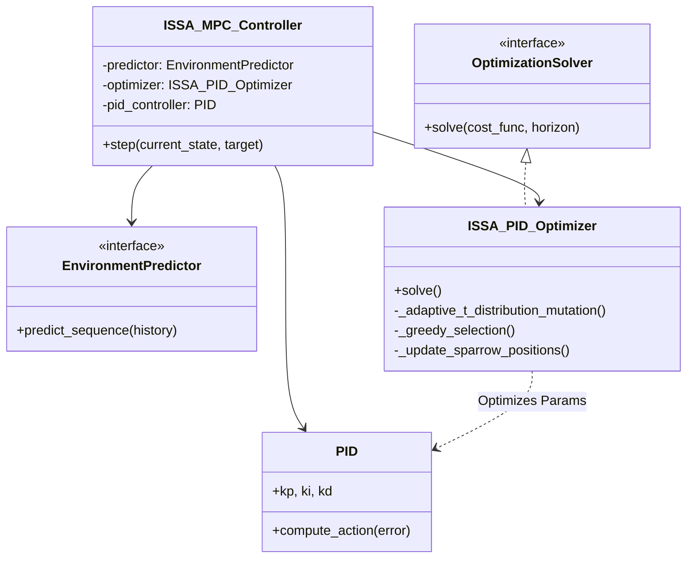

# 项目进展总结与后续工作计划

## 1. 当前工作进展总结 (Current Work Summary)

目前项目 (`D:\degree_code`) 主要分为预测模型构建与控制策略实现两个核心部分。

### 1.1 方案一：多变量温室环境预测模型 (TPLC-Net)
**路径**: `D:\degree_code\scheme_1`

已提出并实现了一种**基于时序周期与轻量卷积网络的温室环境变量预测模型 (TPLC-Net)**。该模型旨在解决温室环境数据的多尺度、多周期耦合特征提取问题。

*   **核心模块实现**:
    *   **多尺度序列生成**: 通过下采样聚合不同时间粒度的信息。
    *   **1D 到 2D 图像转换**: 利用 FFT 识别显著周期，将一维时间序列重塑为二维图像，引入区间内和区间间局部性。
    *   **变量-尺度解耦重构**: 调整维度以独立处理多变量特征。
    *   **2D 深度可分离卷积**: 采用轻量化卷积提取时空模式，并融合跨通道信息。
    *   **多尺度特征融合**: 聚合不同尺度的预测结果。
*   **实验与对比**:
    *   **基线模型**: 集成了 LSTM, PatchTST, TimeMixer, TimesNet 等先进时序模型作为对比 (`baselines/`)。
    *   **自动化实验**: 编写了 `run_compare_experiment.py` 用于自动化运行对比实验并记录结果 (`compare_result/`)。

### 1.2 方案一控制部分：基于 ISSA 的 PID 参数优化
**路径**: `D:\degree_code\scheme_1_PID`

实现了基础的温室环境智能控制闭环，主要验证了智能优化算法在 PID 参数整定上的有效性。

*   **核心组件**:
    *   **虚拟温室环境 (`greenhouse_env.py`)**: 实现了基于物理公式的温度、湿度变化模拟。
    *   **改进麻雀搜索算法 (`issa.py`)**: 实现了带有 t-分布变异策略的改进麻雀搜索算法，增强了全局寻优能力。
    *   **PID 控制器 (`pid.py`)**: 实现了标准的多回路 PID 控制逻辑。
*   **当前演示 (`Module4_Demo.ipynb`)**:
    *   展示了如何利用 ISSA 算法在虚拟环境中寻找最优的 PID 参数 ($K_p, K_i, K_d$)。
    *   **当前目标**: 最小化设定点追踪误差 (MSE)，即让环境紧跟预设的固定温度/湿度曲线。

---

## 2. 后续工作计划 (Future Plans)

根据 `Future_plan.md` 和 `scheme_1_algo.md` 的描述，下一步的核心任务是将控制目标从简单的“轨迹追踪”升级为更具实际意义的“**经济效益最大化 (Profit Maximization)**”，并构建完整的 **ISSA-MPC (Model Predictive Control)** 架构。

### 2.1 引入生物与物理模型 (Step 1 & 2)
为了评估经济效益，需要引入能够量化作物产量和能源消耗的机理模型。

*   **实现作物生长模型 (`TomatoYieldModel`)**:
    *   参考 Vanthoor 等人模型或论文公式。
    *   输入：温度、PAR (光合有效辐射)、CO2 浓度。
    *   逻辑：光合作用速率 -> 同化物分配 -> 干物质积累 -> 产量估算。
*   **实现能耗模型 (`EnergyCostModel`)**:
    *   输入：加热器功率、通风率、补光灯状态等控制动作。
    *   结合当前的能源价格（电价、燃料价格）计算运行成本。

### 2.2 升级优化目标函数 (Step 3)
将优化器的适应度函数从单一的误差控制转变为多目标经济优化。

*   **当前目标**: $J = \min \sum (T_{actual} - T_{set})^2$ (最小化误差)
*   **新目标**: $J = \max (\text{YieldRevenue} - \text{EnergyCost})$ (最大化利润)
    *   优化器不仅要考虑稳态误差，还要权衡“为了增加产量是否值得消耗更多能源”。

### 2.3 构建 ISSA-MPC 预测控制框架 (Step 4 & System Integration)
结合 TPLC-Net 的预测能力，实现基于滚动时域的预测控制。

*   **预测驱动**: 利用 TPLC-Net 预测未来一段时间 ($H$) 的室外气象及环境自然演化趋势，作为控制系统的先验输入。
*   **滚动优化 (Receding Horizon Optimization)**:
    *   使用 ISSA 直接优化未来 $N$ 步的**最佳设定点轨迹 (Optimal Setpoints)** 或直接优化控制动作序列。
    *   这些设定点不再是人为固定的，而是算法根据当前的作物状态和能耗模型计算出的“最赚钱”的环境条件。
*   **执行层**: 底层 PID 控制器负责执行这一组动态变化的最佳设定点。

### 总结路线图
1.  **Modeling**: 完成 `TomatoYieldModel` 和 `EnergyCostModel` 的代码封装。
2.  **Objective**: 修改 `issa.py` 或主循环中的 `fitness_function`，接入经济模型。
3.  **Integration**: 在 `Module4_Demo` 的基础上，创建一个新的 ISSA-MPC 实验模块，整合预测信息、经济模型和 PID 控制。

## 3. 详细实施计划 (Detailed Implementation Plan)

### 步骤 1: 升级温室环境 (`greenhouse_env.py`)
目前的环境模型仅包含温度和湿度，无法支持作物产量模拟。
*   **状态扩展**: 在状态向量中加入 `CO2` (二氧化碳浓度) 和 `PAR` (光合有效辐射)。
*   **输入更新**: 更新 `step` 函数以接收具体的控制信号：`u_heat` (加热), `u_vent` (通风), `u_light` (补光), `u_co2` (二氧化碳施肥)。
*   **天气模拟**: 确保天气模拟器能够生成随时间变化的太阳辐射数据。

### 步骤 2: 实现番茄产量模型 (`TomatoYieldModel`)
在 `models.py` 中实现基于生物物理机制的产量模型 (参考 Vanthoor 等人)。
*   **逻辑**: 光合作用 -> 碳同化物缓冲 -> 器官分配 (果实、茎、叶)。
*   **输入**: `Temperature` (温度), `PAR` (光照), `CO2` (浓度)。
*   **输出**: `dry_matter_increment` (干物质/产量增量, kg)。

### 步骤 3: 实现能耗成本模型 (`EnergyCostModel`)
在 `models.py` 中实现基于执行器功率的成本计算模型。
*   **逻辑**: 成本 = $\sum (\text{功率} \times \text{时间} \times \text{单价})$。
*   **输入**: `u_heat`, `u_light`, `u_vent` 等控制动作。
*   **输出**: `cost` (货币成本或能耗量)。

### 步骤 4: 构建 ISSA-MPC 目标函数
重构优化器的适应度函数，使其能够进行前向模拟。
*   **前向模拟**: 在适应度函数内部，利用升级后的 `GreenhouseEnv` 模拟未来 $N$ 步的状态。
*   **利润计算**: $Profit = \sum (\text{Yield} \times \text{Price}) - \sum (\text{Cost})$。
*   **返回值**: 返回 `-Profit` (因为优化器通常求最小值)。

### 步骤 5: 整合 ISSA-MPC 实验
创建一个新的 Notebook (`run_issa_mpc_experiment.ipynb`) 整合所有模块。
*   **滚动时域控制 (RHC)** Loop:
    1.  在时刻 $t$，使用 ISSA 寻找未来 $N$ 步能使利润最大化的最佳控制序列 $u_{t:t+N}$。
    2.  应用第一步的控制动作 $u_t$。
    3.  更新系统状态，推进到下一时刻。
*   **对比分析**: 比较 "传统恒定设定点控制" vs "ISSA-MPC 经济优化控制" 的累积利润。

### 3. 详细实施计划 (Detailed Implementation Plan) - 硕士论文版

#### 步骤 1: 建立基于机理的温室动态环境模型 (`greenhouse_env.py`)
为了满足学术严谨性，环境模型需基于能量与质量平衡方程构建。
*   **状态方程 (ODEs)**: 实现 $dT_{in}/dt$ (能量平衡), $dH_{in}/dt$ (水汽平衡), $dCO_{2}/dt$ (碳平衡)。
*   **多变量耦合**: 须在代码中体现通风对温湿度、CO2 的同时影响，以及补光灯的热效应。
*   **外部扰动**: 集成 TPLC-Net 预测的室外气象数据作为环境的边界条件。

#### 步骤 2: 构建作物光合生产与产量模型 (`models.py`)
实现简化的番茄生理生长模型（参考 Heuvelink 或 Vanthoor 框架）。
*   **光合模块**: 计算冠层总光合速率 $P_{gc}$ (受 PAR, CO2, T 共同制约)。
*   **呼吸模块**: 计算维持呼吸 $R_m$ (受温度指数影响) 和生长呼吸 $R_g$。
*   **干物质分配**: 计算净同化物向果实的分配比例，输出产量增量 $\Delta Yield$。

#### 步骤 3: 建立分时能耗成本模型 (`models.py`)
为了凸显算法的经济调度能力，引入分时计价机制。
*   **动态电价**: 设定峰谷电价 (Peak/Off-peak pricing)，测试算法是否具有“削峰填谷”的智能特性。
*   **设备能耗**: $Cost = \int (P_{heat} \cdot u_{heat} + P_{light} \cdot u_{light}) \cdot Price(t) dt$。

#### 步骤 4: 设计带约束的 ISSA-MPC 目标函数
优化目标从单一误差最小化转变为**带安全约束的经济效益最大化**。
*   **综合目标函数**:
    $$ J = \min \left[ -(\alpha \cdot \text{Yield} - \beta \cdot \text{Cost}) + \lambda \sum \text{Penalty}_{violation} + \gamma \sum (\Delta u)^2 \right] $$
*   **惩罚项 (Penalty)**: 对超出作物适宜生长区间（如温度过高/过低、湿度极高）的状态施加重惩罚，确保控制策略虽然“省钱”但必须“保命”。
*   **控制平滑项**: 抑制控制动作的剧烈抖动，保护执行机构。

#### 步骤 5: 仿真实验与消融分析 (`run_issa_mpc_experiment.ipynb`)
设计多组对比实验以验证 TPLC-Net 和 ISSA-MPC 的有效性。
*   **Baseline**: 传统的逻辑控制 (Rule-based) 或恒定设定点 PID。
*   **Ablation Study (消融实验)**:
    *   **无预测 vs 有预测**: 对比是否使用 TPLC-Net 的预测信息，验证“前瞻性”带来的节能效果。
    *   **无约束 vs 有约束**: 验证惩罚项对作物安全的保护作用。
*   **评价体系**: 累积净利润 (Net Profit)、产量 (Total Yield)、总能耗 (Total Energy)、环境适宜度 (Comfort Index)。

---

## 4. 基于预测模型的 MPC 滚动优化框架设计 (MPC Framework Design)

本节具体描述如何实现核心的 **基于 ISSA-PID 的滚动优化预测控制框架**。依据 `scheme_1_algo.md`，该框架并不直接优化底层控制动作，而是利用预测模型的前瞻性信息，**在线协同寻优多回路 PID 控制器的参数 ($K_p, K_i, K_d$)**。

### 4.1 核心抽象接口设计 (Core Abstractions)
遵循依赖倒置原则 (DIP)，定义标准的预测、优化与代价评估接口，确保各模块可插拔。

*   **`EnvironmentPredictor` (ABC)**
    *   **定义**: `predict_next_state(current_state, control_action, external_disturbances)`
    *   **作用**: 定义预测模型的标准行为。现有的 TPLC-Net 将作为 Oracle，基于历史序列输出未来 $H$ 步的环境状态演化趋势 $X_{t+1:t+H}$。
    *   **注释**: 对应公式 (13)，即无控制/特定控制下的自然演化预测。

*   **`OptimizationSolver` (ABC)**
    *   **定义**: `solve(cost_function, constraints, horizon)`
    *   **作用**: 定义通用优化器的行为。在此框架下，它的任务是在解空间中寻找让目标函数 $F$ 最小的 **PID 参数组合**。

*   **`CostFunction` (ABC)**
    *   **定义**: `evaluate(predicted_states, control_sequence)`
    *   **作用**: 定义适应度函数。计算在特定 PID 参数下，未来 $H$ 步系统的综合性能指标。

### 4.2 强化 ISSA 优化算法 (Enhanced ISSA)
重构 `ISSAOptimizer` 类，依据 `scheme_1_algo.md` 引入 **自适应 t-分布变异** 策略，以增强标准麻雀搜索算法 (SSA) 的全局寻优与局部收敛能力。

1.  **麻雀种群机制 (Sparrow Population Mechanism)**
    *   **分工**: 划分为 **发现者 (Producers)**（全局搜索）、**加入者 (Scroungers)**（局部搜索）、**警戒者 (Vigilantes)**（反捕食跳出）。
    *   **逻辑**: 发现者引导种群向高适应度区域移动，加入者跟随，警戒者负责防止陷入局部最优。

2.  **自适应 t-分布变异 (Adaptive t-distribution Mutation)**
    *   **原理**: 利用 t-分布形态随自由度变化的特性。将当前迭代次数 $t$ 作为 t-分布的自由度参数 $n$。
    *   **初期 ($t$ 小)**: t-分布具有显著的长尾特征，变异产生大幅度扰动，增强**全局探索**能力。
    *   **后期 ($t$ 大)**: t-分布逼近标准正态分布，变异扰动微小，增强**局部精细开发**能力。
    *   **公式**: $X'_{best} = X_{best} + X_{best} \cdot T(iter)$，其中 $T(iter)$ 为自由度为 $iter$ 的 t-分布随机数。

3.  **贪婪选择策略 (Greedy Selection)**
    *   **逻辑**: 仅当变异后的新位置适应度更优时 ($F(X'_{best}) < F(X_{best})$)，才更新全局最优位置，否则保留原位置，确保算法收敛性。

### 4.3 MPC 控制器逻辑 (ISSA-PID Controller Logic)
编写 `MPCController` 类，实现“预测—优化—控制”闭环。与传统 MPC 直接输出 $u$ 不同，本方案输出最优 PID 参数。

1.  **Rolling Horizon (滚动时域)**
    *   在每个控制周期 $t$，获取当前环境状态。
    *   调用 **TPLC-Net** 预测未来 $H$ 步的环境变化趋势（或作为优化的环境模拟器）。

2.  **PID Parameter Optimization (PID 参数寻优)**
    *   **编码**: 每个麻雀个体代表一组多回路 PID 参数：$Z_j = [K_p^T, K_i^T, K_d^T, K_p^{Rh}, \dots]$。
    *   **适应度评估**: 在虚拟环境中，使用该组 PID 参数模拟未来 $H$ 步的控制过程。
    *   **目标函数**: 
        $$ F = \sum_{h=1}^{H} \omega_T (T_{t+h} - T_{opt})^2 + \sum_{h=1}^{H} \lambda (u_{t+h} - u_{t+h-1})^2 $$
        即最小化 **设定点追踪误差 (MSE)** 并惩罚 **控制动作的剧烈变化**。

3.  **Execution (执行)**
    *   将 ISSA 找到的当前时刻最优 PID 参数 $\mathbf{Z}^*$ 下发给底层的 PID 控制器。
    *   底层 PID 控制器根据实时误差计算具体的控制量 $u_t$ 并执行。

### 4.4 模拟集成测试 (Mock Integration)
验证 ISSA-PID 架构的有效性。

1.  **`MockGreenhouseSim`**:
    *   模拟温室环境对 PID 控制动作的响应。
    *   用于在优化循环内部快速推演未来 $H$ 步的状态。

2.  **`main` 流程演示**:
    *   循环 $T$ 个周期。
    *   每一步展示：ISSA 迭代收敛过程 -> 选出的最佳 $K_p, K_i, K_d$ -> 实际环境响应。

### 4.5 UML 类设计图 (Class Structure)

